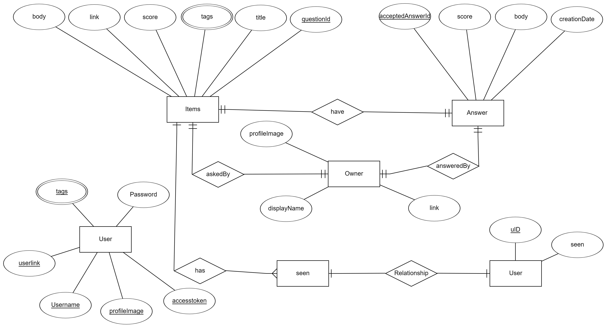

# Stack Digest

# Project Live <a href="stackdigest.herokuapp.com">here</a>
# Read about project here <a href="stackdigest.herokuapp.com/about">here</a>

# What is stackdigest? 

Stackdigest is a webapp to implement quora like features for stackoverflow which will help in growth of user's knowledge. It constructs a feed which has commonly asked/trending questions on stackoverflow. Through this user can get through most common problems of computer programming and avoid them which would save user's time too.

# Why stackdigest?

https://dev.to/stackoverflow/select-post-from-stack-overflow-questions-where-topic-git-order-by-votes-desc-id1

For instance take the above article, how the writer has explained that most popular questions on stackoverflow are related to simple problems.  So on this analysis stackdigest shows most popular /trending so that the user does not waste his time over common issues.

# What is 'my space' and 'all space' ?

My space shows the user articles related to his interests which are taken from his stackoverflow active 'tags' like each user can see  his active tags from his stackoverflow's profile section like:

All space shows the user all popular articles irrespective of his interests.

<h1 id="Setup">How to Setup locally?</h1>
                
Clone the repo then either import the database using stackdigest.sql from repository or create database named 'stackdigest.sql' and provide credentials in files: hibernate.cfg.xml and application.properties and then run <code>mvn install</code> and <code>mvn spring-boot:run</code> then uncomment @Scheduled from StackDigestApplication.java for automated insertion 

# Tech Stack

*   MySQL has been used as **database**. Search **indexing** as BTree has been done for optimisation and **BCNF** **normalisation** has been done.
*   EH-Cache has been used for **in-memory database** optimisation to make user's interaction with the site faster.
*   Spring-Boot Used to fetch REST content from stackoverflow's API and build a webapp for stackdigest.
*   Spring Security with JPA Used to handle security features and OAuth of Stackdigest.
*   Hibernate Hibernate has been used as **ORM** for interactions with MySQL.
*   Thymeleaf template engine has been used for serving HTML content.

##Backend by: 
<a href="https://github.com/fuzious">Arpit Srivastava</a>
##Frontend by:
<a href="https://github.com/">Sudhanshu Mishra</a>

MIT Licence

